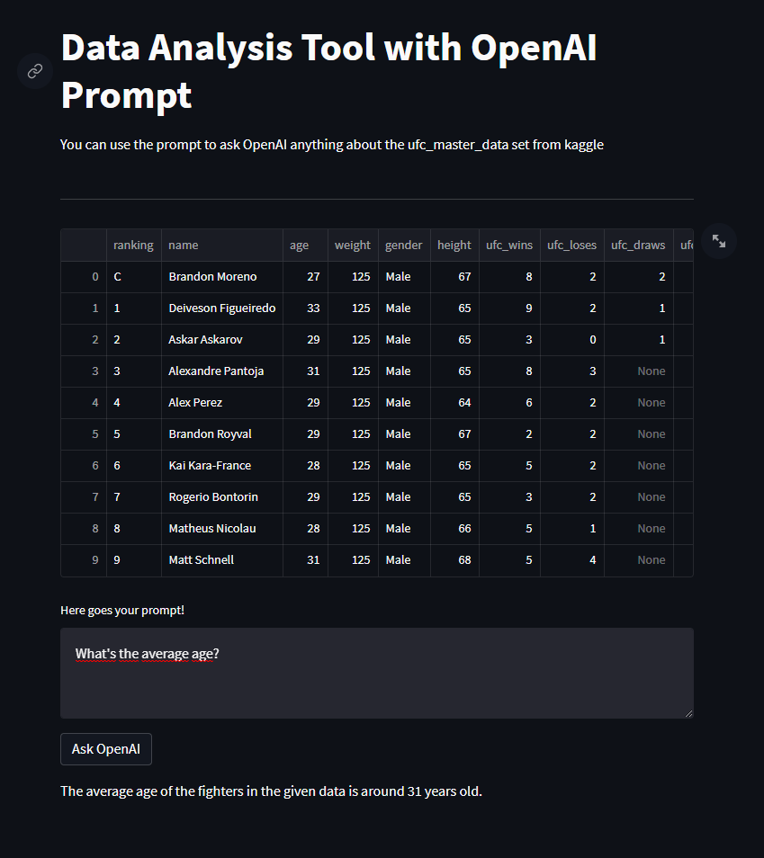

# Data Analysis with OpenAi prompts
Use the prompt to ask the OpenAI LLM (Large Language Model) to get answers about the ufc dataset.

## Resources
1. PandasAI - https://github.com/gventuri/pandas-ai
2. UFC Dataset - https://www.kaggle.com/datasets/mdabbert/ultimate-ufc-dataset

## Issues
There is an error caused while starting streamlit by the latest protobuf version. Therefore the protobuf version needs to be set to protobuf==3.20.* 

Links that describe the issue:

* Stackoverflow - https://stackoverflow.com/questions/72441758/typeerror-descriptors-cannot-not-be-created-directly/72493690#72493690
* Streamlit - https://discuss.streamlit.io/t/typeerror-descriptors-cannot-not-be-created-directly/25639/17